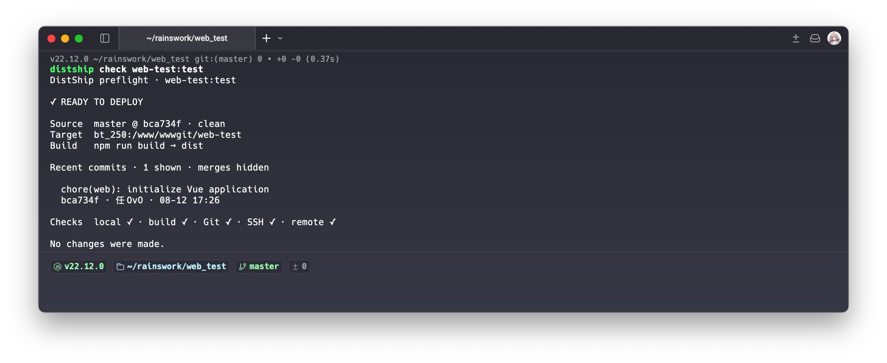

# DistShip

**本地构建，确认变更，安全发布。**

[](https://github.com/sperains/distship/actions/workflows/ci.yml)
[](https://github.com/sperains/distship/releases/latest)
[](LICENSE)

[English](README.md) · [简体中文](README.zh-CN.md)

DistShip 是一个本地优先的静态前端部署命令行工具。

它会在发布前展示 Git 变更、检查部署目标并在本机构建；用户确认后才通过 SSH 上传产物。



## 为什么使用 DistShip？

- **明确发布内容。** 部署前展示准确的 Git 版本和最近的非合并提交。
- **提前发现问题。** 只读检查项目、构建工具、分支策略、SSH 连接和远端目录权限。
- **构建留在本机。** 执行前端项目自己的构建命令，再通过 SSH 上传静态产物。
- **保留操作控制。** 先预览计划和目标，再确认部署，并在本地记录成功历史。
- **复用标准 SSH。** 密钥、端口、跳板机和别名统一交给 `~/.ssh/config` 管理。

## 快速开始

### 1. 安装

#### 使用 Homebrew

```bash
brew install --cask sperains/tap/distship
```

#### 使用 Codex

让 Codex 安装仓库配套的 [`install-distship`](skills/install-distship/SKILL.md)
技能，再通过该技能安装经过校验的最新版本：

```text
从 https://github.com/sperains/distship/tree/main/skills/install-distship 安装技能，
然后使用 $install-distship 安装最新稳定版本。
```

#### 不使用 Codex

从[最新版本](https://github.com/sperains/distship/releases/latest)下载当前平台对应的压缩包和
`checksums.txt`，再按照[安装指南](docs/INSTALLATION.zh-CN.md)完成校验和安装。

### 2. 配置 SSH

先确认系统 SSH 客户端能够连接部署目标：

```bash
ssh staging-web
```

推荐使用 SSH 别名，但不是必填项。DistShip 也支持域名、IP 和
`user@host`。密钥、自定义端口、跳板机、服务器指纹验证和故障排查参见
[SSH 配置指南](docs/SSH_CONFIGURATION.zh-CN.md)。

### 3. 初始化项目

进入前端项目目录执行，或显式传入项目路径：

```bash
cd /前端项目路径
distship init

# 等价的显式写法：
distship init /前端项目路径
```

DistShip 会识别受支持的前端项目信息，提供有依据的默认值，保存前展示配置，并在写入后自动校验。使用
`--advanced` 可以自定义目标 ID、名称、产物目录、允许分支和脏工作区策略。

<!-- markdownlint-disable MD013 MD033 -->
<details>
<summary>查看完整初始化流程</summary>

```text
$ distship init
DistShip 初始化

当前目录可识别为可部署项目时会自动使用，否则请指定项目目录；使用 --advanced 配置全部字段。

✓ 已识别当前项目目录
  /Users/example/projects/web_test

项目分析

  本地目录：/Users/example/projects/web_test
  项目：web_test
  项目类型：Node.js
  包管理器：npm
  Git 分支：未识别
  构建命令：npm run build
  产物目录：未识别

部署目标

  项目：web-test
  部署环境 [test]:

  部署目标 ID：web-test:test
  该标识会显示在 list 中，并用于 check、deploy 和 remove 命令。

构建命令 [npm run build]:
产物目录 (例如 dist): dist
SSH 服务器 (例如 staging-web 或 deploy@example.com): staging-web
服务器部署目录 (绝对路径): /var/www/web-test

配置预览

  部署目标 ID：web-test:test
  项目：web_test
  环境：test
  本地目录：/Users/example/projects/web_test
  构建命令：npm run build
  产物目录：dist
  部署目标：staging-web:/var/www/web-test
  允许分支：任意分支（部署时警告）
  工作区：warn
  配置文件：/Users/example/.config/distship/projects.toml

只会修改本地配置，不会连接服务器。
保存这个部署目标？ [N]: y

✓ 已写入配置
✓ 配置有效

  路径：/Users/example/.config/distship/projects.toml
  部署目标 ID：web-test:test

下一步：distship check web-test:test
```

</details>
<!-- markdownlint-enable MD013 MD033 -->

### 4. 列出、检查并部署

```bash
distship list
```

```text
[1] storefront · test
    标识：storefront:test
    本地：/Users/example/projects/storefront
    远端：staging-web:/var/www/storefront
    分支：test

[2] operations · staging
    标识：operations:staging
    本地：/Users/example/projects/operations
    远端：staging-web:/var/www/operations
    分支：main

[3] docs-site · test
    标识：docs-site:test
    本地：/Users/example/projects/docs-site
    远端：staging-web:/var/www/docs-site
    分支：任意分支（部署时警告）
```

从列表中复制一个部署目标 ID，继续执行后续命令：

```bash
distship check storefront:test
distship deploy storefront:test --dry-run
distship deploy storefront:test
```

部署目标 ID 使用 `project:environment` 格式。

## 部署流程

```text
初始化配置
    ↓
只读预检查
    ↓
确认目标、Git 变更和构建计划
    ↓
用户确认 → 本地构建 → 产物校验 → 增量上传
    ↓
在本地记录成功部署
```

`distship check`
严格只读：不会构建、创建远端目录、上传文件或写入部署历史。`distship deploy --dry-run`
只预览本地计划，不执行构建，也不连接服务器。

真实部署时，DistShip 会：

1. 执行相同的预检查。
2. 展示准确的来源版本和最近的非合并提交。
3. 在本机构建并校验配置的产物目录。
4. 仅在必要时创建远端目录。
5. 使用 `rsync` 增量上传，不删除无关的远端文件。
6. 将成功部署记录到 XDG 状态目录。

仅在明确需要跳过普通确认时使用 `--yes`，安全检查失败仍会阻断部署。

## 环境要求与适用边界

| 范围     | 当前支持                         |
| -------- | -------------------------------- |
| 操作系统 | macOS、Linux                     |
| 项目     | 能生成完整静态产物目录的前端项目 |
| 环境     | 测试、预发布                     |
| 传输     | 系统 SSH 和 `rsync`              |
| 界面语言 | 英文、简体中文                   |

本机需要具备 Git、SSH、`rsync`
和项目配置的构建工具；远端 SSH 用户需要拥有目标目录写入权限。

`v0.1`
**不负责**后端服务、容器、数据库、进程管理、服务器端构建、服务重启或运行时配置。当前采用增量上传，不是原子发布，也不提供自动回滚。

## 常用命令

```bash
distship init [项目目录] [--advanced]
distship list
distship check <project:environment>
distship deploy <project:environment> [--dry-run] [--yes]
distship config validate
distship config remove <project:environment>
distship version
```

使用 `--config <路径>` 指定配置文件；使用 `--lang en` 或 `--lang zh-CN`
覆盖终端语言自动识别结果。

## 文档

- [安装与升级](docs/INSTALLATION.zh-CN.md)
- [SSH 配置指南](docs/SSH_CONFIGURATION.zh-CN.md)
- [配置示例](examples/projects.toml)
- [版本发布流程](docs/RELEASING.md)
- [贡献指南](CONTRIBUTING.md)
- [安全策略](SECURITY.md)
- [变更记录](CHANGELOG.md)

## 从源码构建

```bash
go build ./...
go test ./...
```

## 许可证

DistShip 使用 [MIT License](LICENSE) 发布。
